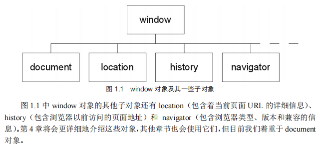
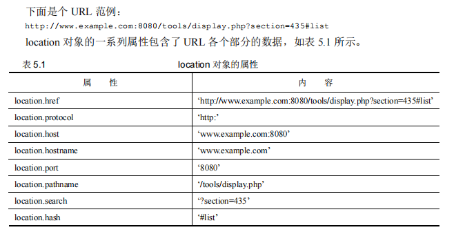
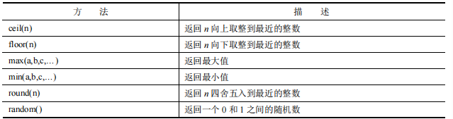
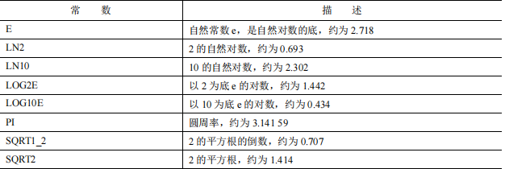
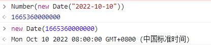
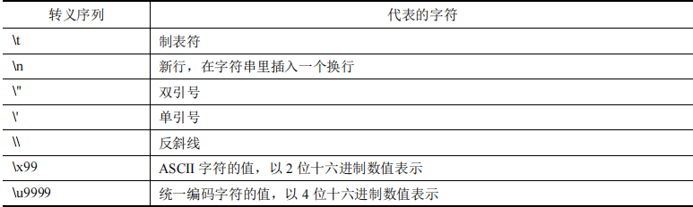
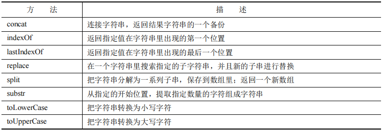
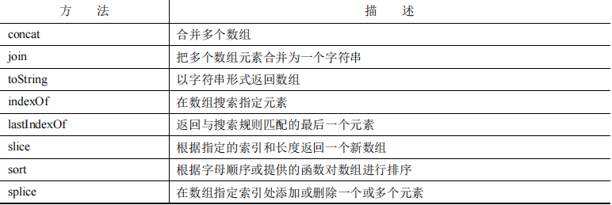
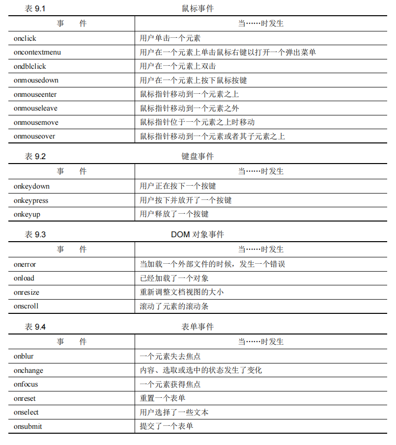

[TOC]

# JavaScript入门

## 第一部分 JavaScript基础

### 第1章 JavaScript

- A.window 和 document对象



- B.对象表示法

  - 句点方式

- C.与用户交互

  - ```html
        <script>
            //弹出一个窗口
            alert(document.title)//读取对象属性
            //在body中写入文字
            document.write("this is class one!")
        </script>
    ```

    

### 第2章 创建简单脚本

- A.在Web页面添加JavaScript
  - 方法一：如上，直接写在script中，放在html中
  - 方法二：建立一个js文件，再用，`<script src = "mycode.js"></script>`
    - 中间不得再写内容

- B.代码注释

  - 用c语言方式即可

- C.变量

  - 无论是何种类型变量，均用var类型
  - 运算方式与C一致
    - +（加号）可将字符串加在一起

- D.捕获鼠标事件

  - onClick

    - 鼠标点击产生反应

  - onMouseOver

    - 鼠标在该区域

  - onMouseOut

    - 鼠标离开该区域

  - 应用

    - ```html
      <!DOCTYPE html>
      <html lang="en">
      <head>
          <meta charset="UTF-8">
          <meta http-equiv="X-UA-Compatible" content="IE=edge">
          <meta name="viewport" content="width=device-width, initial-scale=1.0">
          <title>Document</title>
      </head>
      <body>
          <!-- 增加一个按钮 点击弹出窗口onclick -->
          <input type="button" onclick="alert('you clicked the button')" value="Click Me">
          <!-- 图片切换 鼠标经过图片显示1.jpg 鼠标离开显示2.jpg -->
          
      </body>
      </html>
      ```


### 第3章 使用函数

- A.定义函数
  - function  函数名（） {内容}
    - 别忘了括号
  - 可放在body，或者head中
  - 函数名称必须以字母或下画线开头，可以包含字母、数字和下画线
- B.调用函数
  - 调用函数名即可
  - 可传递多个参数（和其他语言大致相同）
  - 返回值也和其他语言大致相同
- C.匿名函数
  - `var sayhello = function() {alert("sayhello");};`


### 第4章 函数的更多知识

- A.作用域

  - 分两种：
    - 函数作用域
    - 全局作用域
  - 在函数中定义的为局部变量，局部变量不会作用域函数外，但是，函数中可以更改全局变量
  - 关键词this
    - 可调用全局变量
  - 使用let和const
    - let x 可以保证块级变量，仅作用于该花括号内
    - const x 表示，x将无法改变

- B.箭头函数

  - 在匿名函数的基础上更改
  - `var sum = (x,y,z) => alert(x+y+z);`
    - 多个语句可用花括号

- C.默认参数

  - 与python一致

- 代码

  - ```html
    <!DOCTYPE html>
    <html lang="en">
    
    <head>
        <meta charset="UTF-8">
        <meta http-equiv="X-UA-Compatible" content="IE=edge">
        <meta name="viewport" content="width=device-width, initial-scale=1.0">
        <title>作用域</title>
    </head>
    
    <body>
        <!-- 4.1作用域 -->
        <!-- <script>
            //全局变量
            var a = 10;
            var b = 10;
            function showVars() {
                //函数变量
                var a = 20; //声明一个新的局部变量 'a' 
                b = 20; //改变全局变量'b'的值
                return "Local variable 'a' = " + a + "\nGlobal variable'b' = " + b;
            }
            var message = showVars();
            alert(message + "\nGlobal variable'a' = " + a + "\nGlobal variable'a' = " + b);
        </script> -->
        <!-- <script>
            var x = 100
            function myfuntion(x){
                var y = x;
                if(x>50){
                    // var y = 10;
                    let y = 10
                    alert("Inner y = "+ y);//10
                }
                alert("Outer y = "+ y)//vay y时显示 10 let 时 100
            }
        </script> -->
        <script>
            // < !--4.2箭头函数-- >
            //一个语句不用花括号，多个语句加花括号
            var sum = (x,y,z) => alert(x+y+z);
        </script>
        <input type="button" onclick="sum(3,4,5)" value="Click Me">
        <!-- 4.3设置默认参数 -->
        <!-- 与python一致 -->
    </body>
    
    </html>
    ```

    


### 第5章 DOM对象和内置对象

- A.与用户交互
  - alert()
    - 弹出一个信息对话框
    - 把字符串作为参数
    - 没有返回值
  - confirm()
    - 弹出模态对话框
    - 字符串为输入
    - 两个按钮，两个返回值
  - prompt()
    - 弹出模态对话框
    - 字符串为输入
    - 用户可输入字符串
    - ok：返回用户输入/默认值      cancel：返回null
- B.根据id选择元素
  - getElementById()
    - 可以得到相应ID的全部属性还有方法
  - innerHTML
    - 读取或者写入元素内部内容
- C.访问浏览器历史记录
  -  JavaScript 里，浏览器的历史记录是用 window.history 对象来表示的
  - 属性：
    - history只有一个属性，就是长度(length)
  - 方法：
    - forward() 可得到历史页表下一个页面（前进）
    - backward可得到历史页表前一个页面（后退）
    - go(n)
      - n正：前进n个页面
      - n负：后退n个页面
      - 也可加字符串
        - 找到第一个符合的

- D.使用location对象

  - 
  - 用location对象导航
    - 直接设置href
      - `location.href = 'www.newpage.com'`
      - 转移新的页面，原始页面保留在历史记录中
    - 用replace
      - `location.replace('www.newpage.com')`
      - 新页面在浏览器还有记录中代替旧页面
  - 刷新页面
    - `location.reload()`
      - 不加参数会加在缓存
      - 加参数true不加载缓存
  - 获取浏览器信息：navigator
    - navigator 对象包含了浏览器程序本身的数据

- E.日期和时间

  - ```html
    新建一个包含日期和时间信息的 Date 对象的最简单方法是：
    var mydate = new Date(); 
    变量 mydate 就是一个 Date 对象，其中包含了创建对象时的日期和时间信息。
    JavaScript有很多用于获取、设置和编辑 Date 对象中的数据的方法，下面是一些范例：
    var year = mydate.getFullYear(); //四位数字表示的年份，比如 2012 
    var month = mydate.getMonth(); //数字表示的月份，0～11，0 表示 1 月，以此类推
    var date = mydate.getDate(); //日期，1～31 
    var day = mydate.getDay(); //星期，0～6，0 表示星期日，以此类推
    var hours = mydate.getHours(); //时，0～23 
    var minutes = mydate.getMinutes(); //分，0～59 
    var seconds = mydate.getSeconds(); //秒，0～59
    mydate.getDateString//获得日期的年月日等
    mydate.getTimeString//活动时间类型
    ```

- F.数学方法

  - 
  - 常数
    - 

- G.关键词with

  - 调用对象是不用指定这个对象

    - ```html
      with (Math) { 
       var myRand = random(); 
       var biggest = max(3,4,5); 
       var height = round(76.35); 
      }
      ```

- 例子

  - ```html
    <!DOCTYPE html>
    <html lang="en">
    
    <head>
        <meta charset="UTF-8">
        <meta http-equiv="X-UA-Compatible" content="IE=edge">
        <meta name="viewport" content="width=device-width, initial-scale=1.0">
        <title>Document</title>
        <style>
            /* td {
                border: 1px solid gray;
                padding: 3px 5px;
            } */
            /* 5时间的例子 */
            p {
                font: 14px normal arial, verdana, helvetica;
            }
        </style>
        <script>
            function telltime() {
            var out="";
            var now=new Date();
            out+="<br />Date: "+now.getDate();
            out+="<br />Month: "+now.getMonth();
            out+="<br />Year: "+now.getFullYear();
            out+="<br />Hours: "+now.getHours();
            out+="<br />Minutes: "+now.getMinutes();
            out+="<br />Seconds: "+now.getSeconds();
            document.getElementById("div1").innerHTML=out;
        }
        </script>
    </head>
    
    <body>
        <!-- 5.1与用户交互 -->
        <!-- <SCript>
            var answer = confirm("do you want to continue?");
            if (answer) {
                var name = prompt("what is your name?","Jone");
                alert("hello "+name);
            }
        </SCript> -->
        <!-- 5.2根据id选择元素 -->
        <!-- <div id = "div1">
            <p>记录学习js的一天</p>
        </div>
        <script>
            //更改盒子里面的内容
            document.getElementById("div1").innerHTML = "<p>我很充实</p>"
        </script> -->
        <!-- 5.4使用navigator -->
        <!-- <script>
            document.write("<table>");
            document.write("<tr><td>appName</td><td>" + navigator.appName + "</td></tr>");
            document.write("<tr><td>appCodeName</td><td>" + navigator.appCodeName
                + "</td></tr>");
            document.write("<tr><td>appVersion</td><td>" + navigator.appVersion
                + "</td></tr>");
            document.write("<tr><td>language</td><td>" + navigator.language
                + "</td></tr>");
            document.write("<tr><td>cookieEnabled</td><td>" + navigator.cookieEnabled
                + "</td></tr>");
            document.write("<tr><td>cpuClass</td><td>" + navigator.cpuClass
                + "</td></tr>");
            document.write("<tr><td>onLine</td><td>" + navigator.onLine + "</td></tr>");
            document.write("<tr><td>platform</td><td>" + navigator.platform
                + "</td></tr>");
            document.write("<tr><td>No of Plugins</td><td>" + navigator.plugins.length
                + "</td></tr>");
            document.write("</table>");
        </script> -->
        The current date and time are:<br />
        <div id="div1"></div>
        <script>
            telltime(); 
        </script>
        <input type="button" onclick="location.reload()" value="Refresh" />
    </body>
    
    </html>
    ```


## 第二部分 JavaScript 编程

### 第6章 数字和字符串

*Javascript 自主识别数据类型*

- A.数值

  - 与其他语言基本相同

- B.全局方法

  - toString()
    - 可加基数换成进制（2，8，16）
  - toExponential(n)
    - 指数表示法
    - 显示为指数形式，n代表小数

- C.Number对象

  - 注意

    - 全局变量方法保持活跃（可直接用isFinite()）
    - 但是有一些有差别
      - isNaN()和Number.isNaN不一样

  - Number.isNaN()

    - 作用

      - 检测是否不是数值类型

      - 是数值返回 false
      - 不是返回true

  - Number.isInteger()

    - 作用
      - 判断是否是整数
      - 是返回true
      - 不是返回false
    - 注意
      - 新版本浏览器可用

  - Number.parseFloat()和Number.parseInt()

    - 作用：强制转化
    - parseFloat()
      - 如第一个是数字，则识别到最后一个数值，并返回
      - 如第一个不是数字，返回NaN
    - parseInt()
      - 一个参数时：作用与parseFloat()相同
      - 两个参数时：第二个代表返回进制

  - Number.isFinite()

    - 作用：判断是否是无穷大
      - 数值返回TRUE
      - 非数值或者数值无穷大（2的53次方）返回false

- D.Number()函数

  - 作用：尽全力返回一个数值，若返回不了，返回NaN

    - ```javascript
      Number(true); // 返回 1 
      Number(false); // 返回 0 
      Number("666"); // 返回 666 
      Number(021-555-3565); // 返回-4103 
      Number('horse'); // 返回 NaN
      ```

调试台：`ctrl+shift+j`可以打开谷歌浏览器调试台



- E.布尔值
  - true（非零）   false（零）
  - !可以颠倒布尔值
- F.null(空)和undefined(未定义)

### 第7章 操作字符串

- A.字符串

  - length属性

    - myString.length可以返回字符串长度

  - 与大多语言一致

    - 

  - 字符串方法

    - 

      - ```html
        <!DOCTYPE html>
        <html lang="en">
        
        <head>
            <meta charset="UTF-8">
            <meta http-equiv="X-UA-Compatible" content="IE=edge">
            <meta name="viewport" content="width=device-width, initial-scale=1.0">
            <title>操作字符串</title>
        </head>
        
        <body>
            <!-- 7.1 字符串 -->
            <!-- <script>
                // concat   链接字符串
                var string1 = "The quick brown fox ";
                var string2 = "jumps over the lazy dog";
                var longString = string1.concat(string2);//The quick brown fox jumps over the lazy dog
                //返回值是长句子，并不改变str1,str2
                //alert(longString)
        
                // indexOf  找第一个
                var str1 = "The quick brown fox";
                //alert(str1.indexOf('fox')); //返回 16(从零开始) 
                //alert(str1.indexOf('dog')); //返回-1(找不到返回-1)
                //lastIndexIf() 找最后一个
        
                //repeat 返回重复次数
                var inStr = "lots and ";
                var outStr = str.repeat(3); // outStr contains ' lots and lots and lots and '
        
                // replace 替换
                var string1 = "The quick brown fox";
                var string2 = string1.replace("brown", "orange"); //string2 现在是"the quick orange fox"
        
                // split()方法把字符串分解为多个子字符串的一个数组，并且返回这个新数组。
                var string1 = "The quick brown fox ";
                var newArray = string1.split(" ");
                //['The', 'quick', 'brown', 'fox', '']
        
                // substr() 提取字符
                //一个参数，提取到尾部
                //两个参数，提取第二个参数个
                var string1 = "The quick brown fox";
                var sub1 = string1.substr(4, 11); //提取"quick brown" 
                var sub2 = string1.substr(4); //提取"quick brown fox"
        
                //toLowerCase()和 toUpperCase()方法把字符串转换为全部小写或全部大写。
                var string1 = "The quick brown fox";
                var sub1 = string1.toLowerCase(); //sub1 的内容是"the quick brown fox" 
                var sub2 = string1.toUpperCase(); //sub2 的内容是"THE QUICK BROWN FOX"
            </script> -->
        
            <!-- 字符串扫描 -->
            <script>
                function detectSpam(input) {
                    input = input.toLowerCase();
                    return input.indexOf("fake");
                }
        
                var text = prompt("what do you want send","");
                alert(detectSpam(text));
            </script>
        </body>
        
        </html>
        ```

- B.模板字符串

  - ```html
        <script>
            var name =prompt("what is your name?","Jion");
            var classname =prompt("which class do you want to enter?","Math");
            alert(`Hello , ${name} ! Welcome to our class ${classname}!`)
            //Hello , Jion ! Welcome to our class Math!
        </script>
    ```

  - 变量用${}包含

  - 字符串用两个反单引号而不是一对单引号(``)

  - 可以忽略换行

### 第8章 数组

- A.数组

  - 创建数组

    - `var myArray = new Array();`
    - `var myArray = [];`

  - 初始化

    - `var myArray = ["1","2"];`
    - var myArray[0] = '1'

  - length

    - myArray.length
      - 总比最大索引大1（有几个元素都行）

  - 数组的方法

    - 

  - 案例

    - ```html
      <!DOCTYPE html>
      <html lang="en">
      
      <head>
          <meta charset="UTF-8">
          <meta http-equiv="X-UA-Compatible" content="IE=edge">
          <meta name="viewport" content="width=device-width, initial-scale=1.0">
          <title>8.1数组</title>
          <!-- 案例 -->
          <script>
      
              function wrangleArray() {
                  var sentence = "JavaScript is a really cool language";
                  //写出它
                  document.getElementById("div1").innerHTML = "<p>" + sentence + "</p>";
                  //转换为一个数组
                  var words = sentence.split(" ");//以空格为划分
                  // 删除'really'和'cool'，并且添加'powerful' 
                  var message = words.splice(3, 2, "powerful");
                  //删除索引3开始的两个索引
                  //返回删除的内容
                  alert('Removed words: ' + message);
                  // 将数组转换为一个字符串，并写出它
                  //原数组改变
                  document.getElementById("div2").innerHTML = "<p>" + words.join(" ") + "</p>";
              } 
          </script>
      </head>
      
      <body>
          <!-- id引用 -->
          <div id="div1"></div>
          <div id="div2"></div>
          <script>wrangleArray();</script>
      </body>
      
      </html>
      ```

- B.遍历数组

  - foreach()

    - 接收一个函数作为参数，将数组的每一个元素均传递进函数
    - 无法返回数组

  - map()

    - 和foreach()差不多
    - 有返回数组

  - for-of

    - 将值一次给变量

  - ```html
        <script>
            // foreach()
            var num = [1,2,3,4,5];
            function cube(x){
                alert(x*x*x);
            }
            num.forEach(cube);
    
            // map
            var num = [1,2,3,4,5];
            function cube(x){
                return(x*x*x);
            }
            var newnum = num.map(cube);//[1,8,27,64,125]
            alert(newnum)
    
            // for-of
            var nums = [1,2,3,4]
            for (var num of nums){
                alert(num)
            }
        </script>
    ```

- C.三点表示法

  - 作用

    - 展开数组
    - 传递数组
    - 收集数据

  - ```html
        <!-- 8.3 三点表示法 -->
        <!-- 展开数组 -->
        <script>
            var array1 = ['apple', 'banana', 'pear'];
            var array2 = ['orange', 'cherry', 'fig'];
            var array2 = ['orange', ...array1, 'cherry', 'fig'];
            //alert(array2)//['orange', 'apple', 'banana', 'pear', 'cherry', 'fig']
        </script>
    
        <!-- 传递数组 -->
        <script>
            var num = [4,2,89,2,5,0]
            alert(Math.min(...num))//将num全部传入
        </script>
    
        <!-- 收集数据 -->
        <script>
            var [a,b,...c] = [1,2,3,4,5,6,7,8]
            //a=1,b=2,c=[3,4,5,6,7,8]
        </script>
    ```

- D.多维数组

  - 在一维数组的基础上拓展(与其他语言一致)

### 第9章 用JavaScript处理事件

- A.事件的类型
  - 鼠标事件
    - 
- B.事件处理器
  - 内敛事件处理器
    - 放在标签里面	
    - `<a href="https://www.w3.org/" onclick="alert('hello W3C!')">World WideWeb Consortium (W3C)</a> `
  - 作为DOM对象的属性的事件处理器
  - addEventListener()
    - 两个参数，第一个注册处理器名字，第二个参数，事件处理函数
  - 添加多个监听器
    - 用addEventListener
- C.event对象
  - 阻止默认行为
    - preventDefault()
  - 事件冒泡和捕获
    - 冒泡，从内向外
    - 捕获，从外向内
  - 关闭冒泡和捕获
    - `e.stopPropagation(); // 阻止进一步冒泡`

### 第10章 程序控制

- A.if()语句

  - if(条件为真) 执行操作

  - 比较操作符

    - 与其他语言比较符一致

  - 等号

    - 两个等号比较测试值是否相等
    - 三个等号比较测试值以及类型是否都相等

  - 多个if

    - ```html
      if (temperature < 64) {
                  message = "Turn on the heating!";
                  heatingStatus = "on";
                  fanStatus = "off";
              } else if (temperature > 72) {
                  message = "Turn on the fan!";
                  heatingStatus = "off";
                  fanStatus = "on";
              } else {
                  message = "Temperature is OK";
                  heatingStatus = "off";
                  fanStatus = "off";
              }
      ```

    - 与c语言一致

    - 简写

      - （条件) ? [条件为真执行]：[条件为佳执行]

  - switch语句

    - ```html
       switch (color) {
                  case "red":
                      message = "Stop!";
                      break;
                  case "yellow":
                      message = "Pass with caution";
                      break;
                  case "green":
                      message = "Come on through";
                      break;
                  default:
                      message = "Traffic light out of service. Pass only with great care";
              }
      ```

  - 逻辑操作符

    - &&  and
    - || or

- B.循环和控制结构

  - while

    - ```
      while(判断条件) {
      	操作语句；
      }
      ```

  - do...while

    - ```
      do {
      	操作语句；
      }while(判断条件)
      ```

  - for

    - ```
      for(x=0;x<10;x++){
      	操作语句；
      }
      ```

  - break跳出循环

  - for...in

    - ```
      for(i in 对象){
      	操作；
      }
      ```

    - 在对象属性里循环

    - 类似python for

- C.设置和使用计时器

  - setTimeout(action,delay)
    - action传入函数或者计算该表达式
    - delay加载多少毫秒
  - clearTimeout()
    - 清除计时器
  - setInterval(action,delay)
    - 和setTimeout差不多
    - 连续性，一致调用，每次间隔delay

## 第三部分 理解JavaScript对象

### 第11章 面向对象编程

- A.认识对象

  - 相当于class（类）

- B.创建对象

  - 创建直接实例

    - JavaScript 有一个内置对象 Object
      - `myNewObject = new Object(); `
    - 添加属性
      - `myNewObject.info = 'I am a shiny new object'; `
    - 添加方法
      - `myNewObject.showInfo = myFunc; `
      - 不加方法（），加括号是把返回值返回给他
    - 用关键词this
      - 指向父函数

  - 匿名函数

    - 传递函数

      - ```
        myNewObject.showInfo = function() { 
         alert(this.info); 
        }
        ```

  - 使用构造函数

    - ```
      function myObjectType(){ 
       this.info = 'I am a shiny new object'; 
       this.showInfo = function(){ 
      alert(this.info); //显示 info 属性的值
       } 
       this.setInfo = function (newInfo) { 
      this.info = newInfo; //覆盖 info 属性的值
       } 
      }
      ```

  - 加参数

    - ```
      定义构造函数时可以设置多个参数：
      function Car(Color, Year, Make, Miles) { 
       this.color = Color; 
       this.year = Year; 
       this.make = Make; 
       this.odometerReading = Miles; 
       this.setOdometer = function(newMiles) { 
      this.odometerReading = newMiles; 
       } 
      } 
      var car1 = new Car("blue", "1998", "Ford", 79500); 
      var car2 = new Car("yellow", "2004", "Nissan", 56350); 
      car1.setOdometer(82450);
      ```

- C.用prototype扩展和继承对象

  - 对象.prototype.新增方法/属性名 = 方法/属性名
  - 对象.prototype = new 被继承对象()

- D.封装

  - 封装是面向对象编程的一种能力，表示把数据和指令隐藏到对象内部。
  - 对于 JavaScript 来说，在构造函数内部声明的变量只能在对象内部使用，对于外部来说是不可见的。
